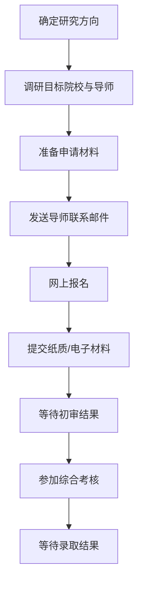

# 博士申请指南

## 中国大陆博士招生制度概述

中国大陆博士招生主要采用以下方式：

| 招生方式 | 说明 | 适用情况 |
|----------|------|----------|
| **申请考核制** | 提交材料 → 初审 → 综合考核（笔试+面试），不参加统一入学考试 | 目前主流方式，大部分985/211高校采用 |
| **本科直博** | 优秀应届本科毕业生直接攻读博士学位 | 需获得推免资格，通常在9-10月进行 |
| **硕博连读** | 在读硕士生通过考核转为博士生 | 面向校内硕士生，一般在硕士第2年申请 |
| **统一考试** | 参加学校组织的博士生入学统一考试 | 少数院校/专业仍保留，日渐减少 |

> 对于海外硕士毕业生（如你），**申请考核制** 是最主要的申请途径。

## 申请流程全景

## 关键准备阶段

### 阶段一：前期调研（建议入学前12-18个月）

- 明确研究兴趣和方向
- 调研目标院校的学科排名和特色
- 筛选潜在导师，阅读其代表性论文
- 了解各校招生方式和时间节点

### 阶段二：导师联系（建议入学前10-12个月）

- 撰写联系邮件，简要介绍学术背景和研究兴趣
- 附上简历和研究计划草案
- 邮件发送后等待1-2周，如无回复可发一次跟进邮件
- 准备与导师的视频/线上面试

### 阶段三：材料准备（建议入学前8-10个月）

- 个人陈述 / 研究计划
- 推荐信（通常需要2-3封）
- 成绩单、学位证书（需翻译公证）
- 英语水平证明
- 代表性成果（论文、项目报告等）

### 阶段四：正式申请（各校具体时间不同）

- 在研究生院招生系统完成网上报名
- 按要求提交电子版或纸质版材料
- 缴纳报名费
- 关注初审结果通知

### 阶段五：综合考核（初审通过后）

- 专业笔试（部分学校/专业）
- 综合面试（研究计划汇报 + 专家提问）
- 英语水平测试（部分学校）
- 思想政治素质和品德考核

### 阶段六：录取与入学

- 查询拟录取名单
- 确认录取、办理相关手续
- 准备入学（住宿、签证/户籍等）

## 各页面导航

- [2026年申请时间线](/guide/timeline) — 各校关键日期一览
- [申请流程详解](/guide/process) — 申请考核制的详细步骤与注意事项
- [申请材料准备](/guide/materials) — 各类文书的撰写指南
- [奖学金信息](/guide/csc-scholarship) — 奖学金类型与申请方式
- [常见问题](/guide/faq) — 海外硕士回国申博FAQ
